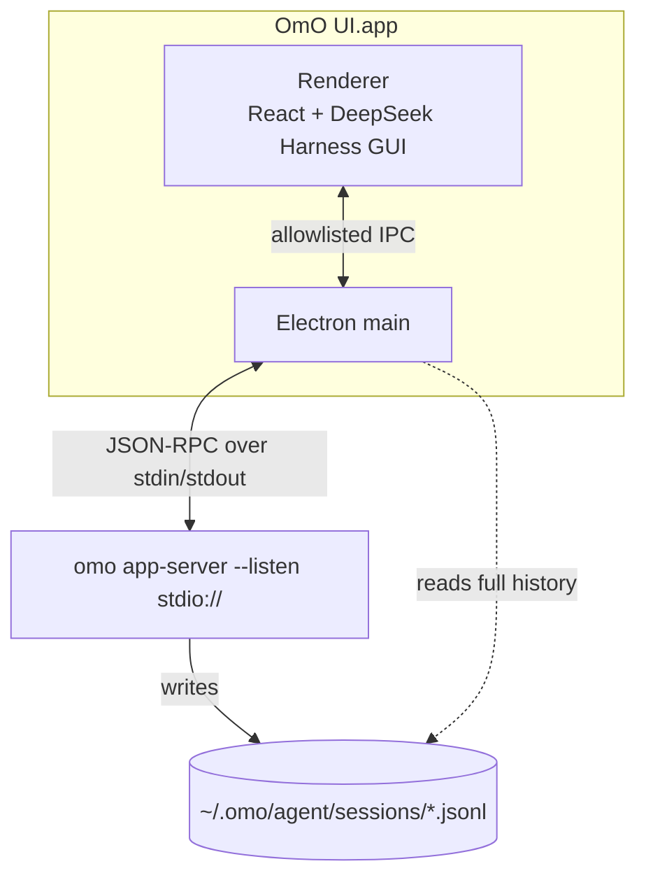

<p align="center">
  
</p>

<h1 align="center">OmO UI Windows</h1>

<p align="center">
  <b>A Windows x64 desktop fork for <a href="https://get.omo.dev">omo</a>, the coding agent.</b><br>
  Skills on <code>/</code>, parallel agents you can watch, todos and goals, and an Aside-style side chat, in one window.
</p>

<p align="center">
  
  
  
  
</p>

<p align="center">
  <a href="#install">Install</a> ·
  <a href="#feature-tour">Feature tour</a> ·
  <a href="#keyboard-shortcuts">Shortcuts</a> ·
  <a href="#how-it-works">How it works</a> ·
  <a href="#development">Development</a>
</p>

<picture>
  <source media="(prefers-color-scheme: dark)" srcset="docs/media/hero-dark.png">
  
</picture>

Maintained by [JunesuChoi](https://github.com/JunesuChoi), this Windows fork is based on [realsigridjin/omo-ui-macosapp](https://github.com/realsigridjin/omo-ui-macosapp), copyright sigridjineth. The original MIT license, DeepSeek notices and font licenses are preserved. This is an independent Windows distribution, not an official upstream release. macOS and iOS source is retained from upstream but is not a supported or device-tested target of this fork. Existing tour images below are upstream screenshots, not Windows release evidence.

OmO UI Windows runs the omo installed with `irm https://get.omo.dev/install.ps1 | iex` or an existing `omo.exe`. It starts `omo app-server` with the inherited Windows environment, using the same sessions, skills, models and credentials as omo in your terminal. The interface comes from the [DeepSeek Harness](https://github.com/deepseek-ai/deepseek-harness) web GUI (MIT).

On each app launch, automatic updates check native omo with `omo update --dry-run` before starting the app server. The compiled updater prints replacement instructions rather than installing, so OmO UI runs the [official installer](https://get.omo.dev/install.sh) for the reported version in the located launcher's directory; it verifies SHA-256 and replaces the executable atomically without editing shell profiles or removing other installs. The check is limited to 20 seconds, installation to 120 seconds, and version verification to 20 seconds. Offline, timeout, unsupported installations, and other failures leave startup enabled with a notice in Settings > omo. The window opens immediately; no running app server is interrupted by an update. Settings > omo shows the result and an automatic-update toggle (on by default, changes apply on the next app launch). Crash recovery and the Restart omo button do not repeat the update.

OmO for iPhone can control this Mac's omo over a USB cable: install the iPhone app, connect the cable, and keep the app open on the phone. OmO UI connects automatically while it runs, and Settings > iPhone shows the connection and device. The bridge is on by default; set `OMO_UI_IPHONE_BRIDGE=0` to disable it. See [the iOS guide](ios/README.md) and [the USB protocol](docs/iphone-bridge.md).

- **Skills on `/`**: pick `/ulw-loop`, `/mass-ulw` or any skill omo can load for the workspace; several skills can go into one message.
- **Watch the agents work**: DAG runs, waves, child tasks, todos and the session goal update live while omo works.
- **Ask on the side with `/btw`**: a side chat answers from the session's context in its own panel and never touches the session.
- **Edit or regenerate**: change an earlier message or reroll the last answer; each opens a branch and keeps the original session.
- **Accounts and quota**: see every Claude and ChatGPT subscription account's 5-hour and weekly usage, and add accounts through omo's own sign-in.
- **Approvals and questions inline**: allow a command once or for the session, or answer omo's questions without leaving the conversation.
- **Your history, restored**: every omo session is listed, including the ones you started in the terminal, with full tool and reasoning history.
- **Installs omo for you**: if omo is missing, the first screen offers to run the official installer.
- **Light, dark, English and Korean.**

[OmO for iPhone](ios/README.md) is the native SwiftUI companion: connect your iPhone to the Mac with a USB cable to browse sessions, stream replies, send or steer omo, stop a turn, and answer approvals and questions. The Mac keeps running omo and holding its credentials; the phone communicates through Apple's USB multiplexer, not Wi-Fi or Bluetooth. iOS suspends the app in the background, so keep it open while you use it. See the iOS guide for building, signing, installing, and the 7-day renewal of free provisioning.

## Windows

Requires Windows x64 and Node.js 22 or later for development. Install omo with the official PowerShell installer, or use your existing `omo.exe` installation:

```powershell
irm https://get.omo.dev/install.ps1 | iex
npm ci
npm run dev
```

Build and package from the repository directory:

```powershell
npm run typecheck
npm test
npm run test:e2e
npm run package:win
```

The installer is `release/OmO UI Windows Setup 0.1.4-win.4.exe`; the runnable directory is `release/win-unpacked`. `npm run package:win:dir` builds only the runnable directory. The app discovers omo using `OMO_UI_OMO_BIN`, `~/.omo/install.json`, `~/.local/bin/omo.exe`, then PATH. It uses the inherited Windows environment, PowerShell for installation and account login, and the native Windows title bar. Use Ctrl+E for side chat. The file manager target opens Explorer; standard installed VS Code and Cursor executables are detected. The fork has a distinct app identity and stores its UI preferences separately from the original OmO UI; omo's agent configuration remains shared.

### App updates

This fork's Windows checks and release workflow runs on PRs to `windows-support`. Merging a version bump into that branch builds and publishes `v<version>` with the Windows installer and `SHA256SUMS`; existing releases are not overwritten. A manual Actions run on `windows-support` can publish the current version after checks. PR runs do not publish releases.

Settings > About > Windows app update checks this fork's GitHub releases, including Windows prereleases. A newer release with a Windows installer and SHA-256 digest enables Download and install. The installer is downloaded and verified before opening; the app then closes so installation can continue. Finish active turns first. Checking never installs automatically. When no release has been published, the UI reports that explicitly. This updates the desktop app, not the separate omo runtime.

Release assets must include `OmO UI Windows Setup <version>.exe` (GitHub stores it as `OmO.UI.Windows.Setup.<version>.exe`) with GitHub's `sha256` asset digest or a `SHA256SUMS` file naming that exact installer. Source pushes alone are not app update releases.

iPhone USB control is macOS-only and is disabled with an explanatory status on Windows. macOS build commands remain available. Windows packages are not configured with a publisher signing certificate.

### Profiles, MCP and Android

The Windows interface also provides full-window searchable settings, a recent-project chooser, a read-only workspace file/diff panel, and a Devices & memory overview. The overview reads this PC's actual app/runtime versions, selected Android connection and local memory Git repository state. It does not represent a cloud subscription, remote-device inventory or verified cloud synchronization.

The composer's Profile tab allows a custom model for each Daily/Geeky, Normal/Heavy profile. Automatic keeps the built-in model matching. Preferences retain these choices between app launches.

Settings > Models also edits native omo research agents (`explore`, `librarian` and existing custom agents), task/research categories and named model mappings. Enter `provider/model[:reasoning]` references in fallback order, one per line. Save and reconnect writes native `[senpi]` overrides in the existing user `~/.omo/omo.jsonc` or `omo.json`, keeping other fields and a first `.models.bak` backup. Project and active configuration profiles can override user settings. These are native omo routes, separate from composer profile preferences.

Each route also offers a provider-grouped list of available models. Choose a model to append it to an agent/category fallback chain without duplicates, or replace a mapping target. You can still edit the references and reasoning suffixes directly.

Settings > MCP > Import configuration accepts Claude/Cursor JSON files containing `mcpServers`. Existing server names are kept, new servers are added to omo's `mcp.json`, and omo reconnects. Finish active turns before importing. The selected source file is not changed.

Import existing MCP servers discovers standard Claude/Cursor configurations. Manual import also accepts VS Code `servers`/`mcp.servers` and BOM-prefixed JSON. Native authentication and lifecycle fields are preserved. Saved server inventory is shown even before a workspace session loads; it is not labeled connected until omo reports a connection.

Settings > Accounts displays read-only opencodex OAuth, Codex and API-key account labels from the registered local proxy. The local management token stays in Electron's main process and is never sent to remote proxies.

Settings > Android uses Android platform-tools (`adb`). Enable USB debugging, authorize the computer, click Find devices and select a ready phone. The app creates an ADB reverse connection and opens a browser control page on that phone; no Android APK is needed. Already-paired wireless ADB also works. Disconnect revokes the browser connection. Windows shows Android instead of the unsupported iPhone section.

### opencodex proxy

Open **Settings > Runtime > opencodex**. Enter the OpenAI-compatible base URL, for example `http://127.0.0.1:10100/v1`. Enter an API key if the proxy requires one; leaving the field blank preserves an existing key. Click **Apply and reconnect** after active turns finish. The app reads `/models`, registers the proxy models and their supported reasoning levels in omo's `models.json`, preserves other providers, and reconnects omo. The key is never returned to the renderer. The proxy process must already be running; the app does not start or manage it.

## Feature tour

The tour below was captured from the built app by `npm run screenshots`, which plays scripted demo sessions through the repository's fake omo (`tests/fixtures/fake-omo.mjs`): every screen is the real interface, and none shows a real person's sessions. The last screenshot is the same app on the installed omo with a real model.

### Skills, one keystroke away

Type `/` at the start of the message or after a space. The menu lists the skills omo can load for the session's workspace, with their scope and description, plus the `/btw` command. Arrow keys move, Enter or Tab inserts, Escape closes. Up to five skills go into one message, and the sent message shows each as a chip.

<p align="center">
  
</p>
<p align="center">
  
</p>

### Watch the agents work

When omo fans work out, for example with mass-ulw, the **Activity** chip in the header counts running work. Open it to see each DAG run with its waves and node states, the live activity of running nodes, and every child task with its agent, model, progress and result. omo's todo list and the session goal sit above the composer.

<p align="center">
  
</p>
<p align="center">
  
</p>

<p align="center">
  
</p>

### Ask on the side with `/btw`

Type `/btw <question>` (or `/side <question>`), press ⌘E, or click **Side chat**. The answer streams into a panel beside the conversation, docked or as an overlay in a narrow window, while the main turn keeps running. Each side chat is its own omo session that receives the recent conversation as read-only background; nothing is added to the main transcript. Side chats are kept per session as BTW #1, BTW #2 and so on.

<p align="center">
  
</p>

### Approvals and questions, inline

When omo needs permission, the card shows the command, the working directory and, when omo gives one, the reason. Allow it once, allow it for the session, or deny it with an optional reason; with the card focused, Enter allows once and Escape denies. Questions from omo arrive as cards with their options and, when omo allows it, a free-text answer.

<p align="center">
  
</p>
<p align="center">
  
</p>

### Answers that read like documentation

Answers stream as Markdown with headings, tables, inline code and highlighted code blocks; reasoning, searches, file edits and commands appear as compact tool cards in the order omo ran them.

<p align="center">
  
</p>

### First run installs omo

If omo is missing, OmO UI says so and offers the official installer, or the command to paste into a terminal. After the install it reconnects on its own.

<p align="center">
  
</p>

### 한국어

Every label in the window is available in Korean; the macOS menu bar stays in English. Choose the language in Settings, or follow the system language.

<p align="center">
  
</p>

### On the real omo

The same window on the installed omo with a real model, with the sidebar collapsed (⌘\\).

<p align="center">
  
</p>

## Install

For this Windows fork, build with `npm ci` and `npm run package:win`, then run the generated Windows installer. Published Windows binaries belong in this fork's [Releases](https://github.com/JunesuChoi/omo-ui-windows/releases), not in Git source history. The following macOS instructions are retained for upstream reference only.

Requirements: macOS 12 (Monterey) or later on Apple silicon, and omo from the official installer (`curl -fsSL https://get.omo.dev/install.sh | bash`). If omo is missing, the onboarding screen offers to run the installer. Building from source needs Node.js 22 or later and npm.

### Homebrew

```sh
brew install --cask realsigridjin/tap/omo-ui
```

The cask installs the latest GitHub release into `/Applications` and clears the quarantine flag, because the app is ad-hoc signed and Gatekeeper would otherwise refuse to open it. `brew upgrade --cask omo-ui` updates it; quit OmO UI first.

### One-line script

```sh
curl -fsSL https://raw.githubusercontent.com/realsigridjin/omo-ui-macosapp/main/scripts/install.sh | bash
```

The script downloads the arm64 zip of the latest release, replaces `/Applications/OmO UI.app` (set `OMO_UI_APP_DIR` to install elsewhere), clears the quarantine flag, and refuses to run while OmO UI is open.

### From source

```sh
npm ci
npm run package:mac
npm run install:app
```

`npm run package:mac` writes `release/mac-arm64/OmO UI.app`, a DMG and a zip into `release/`. `npm run install:app` copies the app into `/Applications` (or `~/Applications` when `/Applications` is not writable), replaces an older copy, and clears the quarantine flag. Quit OmO UI before installing; the script refuses to replace a running app.

### From the DMG

Open `release/OmO UI-<version>-arm64.dmg` and drag **OmO UI** into **Applications**.

### First launch of an ad-hoc signed build

Builds are ad-hoc signed, not signed with an Apple Developer ID or notarized, so Gatekeeper blocks a copy that carries the quarantine flag (for example, a DMG or zip you downloaded). Either right-click the app in Finder, choose **Open**, and confirm, or clear the flag:

```sh
xattr -dr com.apple.quarantine "/Applications/OmO UI.app"
```

## Keyboard shortcuts

| Keys | Action |
| --- | --- |
| ⌘N | New session |
| ⌘E | Show or hide the side chat |
| ⌘\\ | Show or hide the sidebar |
| ⌘, | Settings |
| `/` | Skills and commands menu: ↑ ↓ to move, Enter or Tab to insert, Esc to close |
| Enter / Shift+Enter | Send, or steer the running turn / new line |
| Enter / Esc on an approval card | Allow once / deny |

## Using OmO UI

- **New session**: choose a workspace folder; omo runs with that folder as its working directory. Recent folders are remembered.
- **Sidebar**: lists every omo session, including sessions you started in the terminal, grouped by workspace and searchable. The pills under the search keep only running sessions, or sessions updated today or in the last 7 or 30 days. Selecting one loads its full history.
- **Conversation**: answers stream as they are written. Reasoning, tool calls (commands, file edits, searches) and their results appear as cards.
- **Skills**: type `/` at the start of a message or after a space to list the skills omo can run in the session's workspace, plus the `/btw` command; the list loads once the session has started. Use the arrow keys and Enter or Tab, or click, to insert a skill; Escape closes the list. Pick up to five skills for one message; OmO UI sends them to omo as `/skill:name` commands in front of your text.
- **omo's own message parts**: sent and restored messages show invoked skills as chips, with their instructions behind **Show skill instructions**. Reminders and pointers that omo adds to a message fold into an **omo context** chip, and session titles show `/skill` names instead of the injected text.
- **Provider errors**: when the model provider fails (for example a timeout or a billing error), the turn shows the error omo recorded instead of staying empty.
- **Activity**: when omo spawns child tasks or runs a DAG (for example with mass-ulw), an **Activity** chip in the conversation header counts running work against the total. Click it to list each DAG run with its status, node counts and waves, every node with its state (pending, blocked, scheduled, running, completed, failed, cancelled or skipped) and the latest activity of running nodes, and each child task with its category or agent, model, status, progress and result or error.
- **Todo list and goal**: omo's todo list appears above the composer with done/total counts; expand it to see each phase and item. A goal set in the session (for example by ulw-loop) shows below it with its status, objective and time used.
- **Restored sessions**: a session opened from the sidebar shows the last todo list and the child tasks recorded in its session file, tagged **restored**. DAG runs and live progress appear only while omo reports them.
- **Approvals and questions**: when omo asks for permission or asks you a question, the app shows it inline; answer to let the turn continue.
- **Stop and steering**: Stop interrupts the running turn. Sending a message while a turn runs steers it; a `/btw` message goes to the side chat instead.
- **Side chat (/btw)**: type `/btw <question>` (or `/side <question>`) to ask a side question without touching the session, or press ⌘E or click **Side chat** in the header. The answer streams into a side panel beside the conversation (over it in a narrow window), and the session's transcript gets nothing, even while its turn runs. Each side chat is its own omo session in the same workspace; its first message carries the session's recent messages (at most 64 messages and 64 KiB) as read-only background with an instruction not to edit files, run state-changing commands or start subagents unless you ask. Remove the conversation chip before asking to start without that background. Side chats are kept per session: the picker lists them as BTW #1, BTW #2 and so on, follow-ups continue the selected one, and deleting the session deletes its side chats. They never appear in the sidebar. omo's own `/btw` exists only in its terminal UI, so OmO UI never sends `/btw` to omo.
- **Edit and regenerate**: hover a sent message and click the pencil to edit it (⌘↩ sends, Esc cancels), or click **Regenerate** under the last answer. Both write a new session holding the conversation before that message, titled "… (edited)", resume it and send there; the original session stays unchanged. Both wait until no turn of the session runs.
- **Accounts and quota**: Settings > Accounts lists the subscription accounts in omo's `~/.omo/agent/auth.json` with each account's usage windows (Claude 5-hour, weekly and extra usage; ChatGPT windows and plan), how much is used and when it resets. The app reads usage with each account's own token in the main process; tokens never reach the window. Accounts whose token has expired fold into one line. **Add account** opens omo in Terminal running `/claude-account add`, `/gpt-account add` or `/login`, so omo performs and stores the sign-in; the list refreshes when you return. Pin and Remove call omo for the accounts omo lists.
- **Model picker**: shows the model omo is running and switches models for the next turns.
- **Settings**: theme (system, light, dark), language (system, English, Korean), omo diagnostics (binary path, version, where it was found, process id, whether the login-shell environment was captured, and the `PATH` omo runs with), restart omo, and reinstall omo. **MCP** lists servers, connection status, and expandable tools from omo's `~/.omo/agent/mcp.json`; use Refresh to reload, and log in through omo in the terminal when needed.

## How it works



The Electron main process starts `omo app-server --listen stdio://` as a child process and talks to it over JSON-RPC on stdin/stdout. The child receives your login-shell environment (captured by running `$SHELL -ilc`), so it sees the same `PATH`, API keys and configuration as omo in your terminal. The omo binary is found in this order: `~/.omo/install.json`, `~/.local/bin/omo`, then your login-shell `PATH`. Session history is read from omo's session files under `~/.omo/agent/sessions`. Quitting the app stops the omo child.

## Troubleshooting

- **omo not found**: install it with `curl -fsSL https://get.omo.dev/install.sh | bash`, or use the install button on the onboarding screen. Settings shows the binary in use and where it was found. To force a specific binary, launch with `OMO_UI_OMO_BIN=/path/to/omo open -n "/Applications/OmO UI.app"`.
- **Works in the terminal but not in the app**: apps launched from Finder do not inherit your terminal's environment. OmO UI reads your login shell's environment, so export `PATH` and API keys in a login-shell file (`~/.zprofile` or `~/.zshrc` for zsh), then use **Restart omo** in Settings.
- **A skill is missing from the `/` list**: the list comes from omo for the session's workspace after the session starts. Workspace skills live in `<workspace>/.omo/skills/<name>/SKILL.md`. Skills that omo could not load are counted in a warning row at the bottom of the list.
- **omo terminal commands such as `/model` or `/compact`**: they exist only in omo's terminal UI; use the model picker in the composer instead.
- **Reset preferences**: quit the app and delete `~/Library/Application Support/OmO UI/preferences.json` (theme, language, recent workspaces, model). omo's own sessions and configuration are not stored there.

## Development

```sh
npm ci                 # also downloads the Electron binary (postinstall)
npm run dev            # Vite dev server (renderer hot reload) + Electron
npm run typecheck
npm test               # vitest unit tests
npm run test:e2e       # Playwright-Electron against a fake omo
OMO_UI_E2E_REAL=1 npm run test:e2e:real   # Playwright-Electron against the real omo
npm run package:mac:dir   # build only release/mac-arm64/OmO UI.app (no DMG/zip)
npm run icon           # re-render build/icon.icns and build/icon.png from build/icon.svg
npm run screenshots    # re-capture docs/media from the built app (ffmpeg encodes the GIF)
```

`npm run screenshots` drives the built app with Playwright against the demo scenes in `scripts/readme-demo.mjs`, played by `tests/fixtures/fake-omo.mjs` when `FAKE_OMO_DEMO` is set. `node scripts/readme-media.mjs --only hero,migrate,korean,onboarding,gif` re-captures a subset. The real-omo screenshot is not produced by the script; it was taken from a session on the installed omo in a throwaway workspace.

Environment variables (defined in `shared/ipc.ts`):

| Variable | Effect |
| --- | --- |
| `OMO_UI_OMO_BIN` | Absolute path of the omo binary; when set, no other location is tried. |
| `OMO_UI_QA_PICK_DIR` | Folder returned by the workspace picker without opening the native dialog (tests and QA). |
| `OMO_UI_USER_DATA` | Overrides the app's data directory (tests and QA). |
| `OMO_UI_DEV_URL` | Renderer dev-server URL loaded instead of the bundled `dist/index.html`. |

## Credits

- The interface, design tokens and icons are taken from [DeepSeek Harness](https://github.com/deepseek-ai/deepseek-harness), Copyright (c) 2026 DeepSeek, MIT License. See [NOTICE](NOTICE).
- The Geist and Geist Mono fonts (`src/dsh/theme/Geist-OFL.txt`) and the Montserrat font (`src/dsh/theme/Montserrat-OFL.txt`) are licensed under the SIL Open Font License 1.1.
- The side chat's layout follows a study of the [Aside](https://aside.com) browser's side panel; no Aside code, artwork or fonts are included.
- The OmO UI app icon is an original design.

## License

MIT. See [LICENSE](LICENSE).
